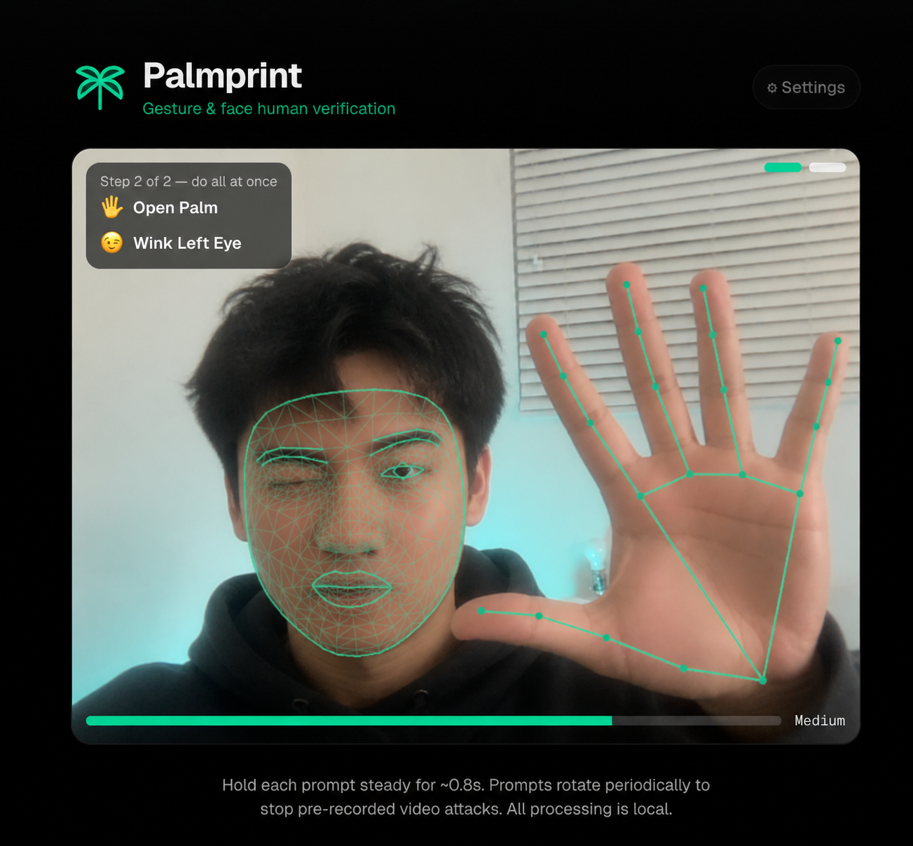

# 🌴 Palmprint

Palmprint is an open-source, camera-based human verification system. Instead of
asking people to solve a CAPTCHA, it asks them to perform randomized hand
gestures and facial expressions in the browser.

Think of it as lightweight **2FA for "are you actually a person?"**

It ships as a working Next.js demo plus SDKs for React, server-side token
verification, script-tag embeds, and Go backends.



[](https://discord.gg/Av22T2TY9D)

## Why

CAPTCHAs are annoying, increasingly weak against automation, and often hostile
to accessibility and privacy. Palmprint explores a different path:

- 🖐️ randomized gesture challenges
- 🙂 optional face-expression prompts
- 🔐 server-signed challenge and session tokens
- 📦 embeddable React components and script-tag widgets
- 🧰 backend SDKs for Node/Next.js and Go
- 🕵️ optional capture hooks for downstream liveness or forensic review

Camera frames are processed locally in the browser with MediaPipe. The normal
verification path does not require streaming camera video to your server.

## What It Does

Palmprint runs a short browser challenge:

1. The server issues a signed challenge token with a fresh nonce.
2. The browser opens the Palmprint camera UI.
3. The user completes randomized hand and/or face prompts.
4. The browser returns an unsigned client token bound to the challenge nonce.
5. The server redeems it for a signed session token.
6. Your protected route accepts the session token as `Authorization: Bearer ...`.

The signed session token is what your app trusts. The browser token alone is not
a credential.

## Project Status

Palmprint is designed as an open-source foundation. The repo includes the core
protocol, local verification UI, SDK surfaces, docs, demos, and examples.

Infrastructure-heavy production features are intentionally left as integration
points or future hosted/enterprise layers:

- durable nonce storage
- rate limiting
- origin allowlists
- audit logs
- capture review workflows
- hosted liveness analysis
- dashboards and team workflows

The current SDK gives you the primitives. You decide how much infrastructure to
wrap around them.

## Features

- **Gesture verification:** MediaPipe hand gestures plus face blendshape checks.
- **Random prompt rotation:** prompts regenerate if not completed quickly, making
  pre-rendered spoofing harder.
- **Security levels:** low, medium, and high challenge presets.
- **Signed server flow:** challenge token -> client token -> signed session.
- **Replay protection:** challenge nonces are consumed once.
- **React provider:** call `verify()` from any action.
- **Page guard:** protect entire UI routes.
- **CAPTCHA-style checkbox:** a familiar "I'm not a robot" shape.

  

- **Standalone script tag:** embed on non-React sites.
- **Widget builder:** generate React and script snippets visually.
- **Capture bucket:** optional PNG/WebM captures tied to verified sessions.
- **Go SDK:** use the same token flow from Go backends.
- **Docs site:** copyable code blocks and integration guides.

## SDKs

| Package | Purpose |
|---|---|
| `@palmprint/react` | React provider, `usePalmprint()`, guard, button widget, CAPTCHA checkbox, camera challenge UI. |
| `@palmprint/server` | Node/Next.js challenge/session tokens, nonce replay protection, route helpers. |
| `@palmprint/core` | Shared types and small token helpers. |
| `@palmprint/widget` | Standalone script-tag bundle for non-React pages. |
| `github.com/masonthemaker/palmprint/packages/go` | Go server SDK with `net/http` handlers and middleware. |

## Quickstart

```bash
npm install
npm run dev
```

Open:

- `http://localhost:3000` for the playground
- `http://localhost:3000/docs` for docs
- `http://localhost:3000/widget` for the widget builder
- `http://localhost:3000/protected-action` for the signed end-to-end demo

For signed flows, set a server secret:

```bash
PALMPRINT_SECRET=replace-with-a-random-string-of-32-or-more-characters
```

## React Example

Mount the provider once:

```tsx
import { PalmprintProvider } from "@palmprint/react";

export default function RootLayout({ children }) {
  return (
    <html>
      <body>
        <PalmprintProvider apiBase="/api/palmprint">
          {children}
        </PalmprintProvider>
      </body>
    </html>
  );
}
```

Then verify before a sensitive action:

```tsx
import { usePalmprint } from "@palmprint/react";

export function WithdrawButton() {
  const { verify } = usePalmprint();

  async function onClick() {
    const { sessionToken } = await verify({
      level: "high",
      reason: "Confirm withdrawal",
    });

    await fetch("/api/withdraw", {
      method: "POST",
      headers: { Authorization: `Bearer ${sessionToken}` },
    });
  }

  return <button onClick={onClick}>Withdraw</button>;
}
```

## Server Example

```ts
import { createPalmprintServer } from "@palmprint/server";

export const palmprint = createPalmprintServer({
  secret: process.env.PALMPRINT_SECRET!,
  issuer: "my-app",
});
```

Protect a route:

```ts
import { requirePalmprint } from "@/lib/palmprintMiddleware";

export const POST = requirePalmprint({ level: "high" }, async (req, session) => {
  return Response.json({ ok: true, verified: session.challenge_nonce });
});
```

## Script-Tag Widget

Use Palmprint on a non-React site:

```html
<script
  src="https://your-cdn.example/palmprint-widget.js"
  data-api-base="https://your-app.example/api/palmprint"
  data-widget="checkbox"
  data-label="I'm not a robot"
  defer
></script>

<script>
  window.addEventListener("palmprint:verified", (event) => {
    const { sessionToken } = event.detail;
    // Send sessionToken to your backend as Authorization: Bearer <token>.
  });
</script>
```

The `/widget` page generates these snippets for you, including the server URL,
theme, challenge level, capture mode, and checkbox/button design.

## Go Backend

The Go SDK lives in `packages/go`.

```go
sdk, err := palmprint.New(palmprint.Options{
	Secret: os.Getenv("PALMPRINT_SECRET"),
})

handlers := palmprint.NewHTTPHandlers(sdk)
http.HandleFunc("/api/palmprint/challenge", handlers.Challenge)
http.HandleFunc("/api/palmprint/redeem", handlers.Redeem)

http.Handle("/api/withdraw",
	handlers.RequirePalmprint(palmprint.LevelHigh, http.HandlerFunc(withdraw)),
)
```

Run the Go tests:

```bash
cd packages/go
go test ./...
```

Run the tiny Go test page:

```bash
cd packages/go
go run ./examples/testpage
```

## Demo Routes

| Route | What it shows |
|---|---|
| `/` | Full Palmprint playground with camera challenge settings. |
| `/docs` | Integration docs with copyable code blocks. |
| `/widget` | Visual widget builder for React and script-tag snippets. |
| `/protected-action` | Canonical signed challenge -> redeem -> protected action flow. |
| `/password-reset` | Page-level route guard. |
| `/account` | Action-level verification with `usePalmprint()`. |
| `/captures` | Optional capture bucket browser. |
| `/human-consent` | Experimental AI-agent -> human approval flow. |

## How The Verification Works

Palmprint combines a few simple pieces:

- MediaPipe detects hands, hand landmarks, face landmarks, and face expressions.
- The challenge generator chooses randomized prompts based on the selected
  security level.
- Higher levels require multiple simultaneous signals, like a hand gesture plus
  a facial expression.
- Prompts rotate if the user does not complete them quickly.
- The server binds successful browser verification to a signed challenge nonce.
- The nonce is consumed during redeem, so the same challenge cannot be reused.

## Token Model

Palmprint uses three token shapes:

- `ppc.<payload>.<signature>`: signed challenge token from your server.
- `palmprint.<payload>`: unsigned browser token after the user completes the UI.
- `pps.<payload>.<signature>`: signed session token your backend can trust.

The browser token exists only as input to the redeem endpoint. Your app should
authorize actions with the signed `pps.` session token.

## Development Commands

```bash
npm run dev
npm run lint
npm run build
npm run build:packages
npm run build:widget
npm run test:conformance
npm run test:go
```

Go SDK:

```bash
cd packages/go
go test ./...
```

## Repository Layout

```text
src/app/             Next.js demo app and API routes
content/docs/        Markdown docs rendered in the app
packages/react/      React SDK
packages/server/     Node/Next.js server SDK
packages/core/       Shared TypeScript helpers and types
packages/widget/     Built standalone widget package
packages/go/         Go server SDK
widget-bundle/       Script-tag bundle source and build script
public/dist/         Built widget demo artifact
```

## Docs

Start the app and open `/docs`, or read the markdown files directly in
`content/docs`.

Useful docs:

- `content/docs/quickstart.md`
- `content/docs/react.md`
- `content/docs/script-tag.md`
- `content/docs/server-sdk.md`
- `content/docs/go.md`
- `content/docs/tokens.md`

## Honest Scope

Palmprint makes it harder to automate simple "prove you are present" gates and
gives your server a signed, replay-protected verification token. It is not a
complete fraud platform by itself.

For high-stakes production use, pair it with durable nonce storage, rate limits,
origin checks, device/session risk scoring, and server-side capture/liveness
analysis.

## License

Apache License 2.0. Palmprint is fully open source; use it, fork it, modify it,
and build on it under the terms in [LICENSE](./LICENSE).
